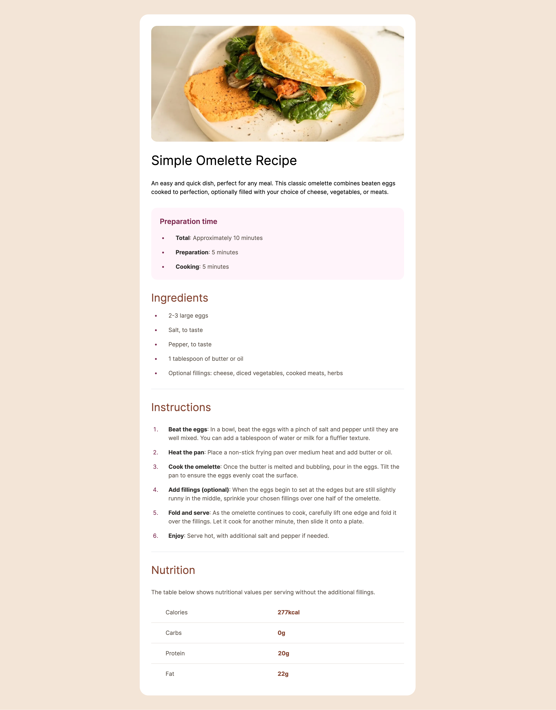

# Frontend Mentor - Recipe page solution

This is a solution to the [Recipe page challenge on Frontend Mentor](https://www.frontendmentor.io/challenges/recipe-page-KiTsR8QQKm). Frontend Mentor challenges help you improve your coding skills by building realistic projects.

## Table of contents

- [Overview](#overview)
  - [The challenge](#the-challenge)
  - [Screenshot](#screenshot)
  - [Links](#links)
- [My process](#my-process)
  - [Built with](#built-with)
  - [What I learned](#what-i-learned)
  - [Continued development](#continued-development)
- [Author](#author)

## Overview

The challenge was to build out this recipe page and get it looking as close to the design as possible. The design used was a JPEG file so i had to eye-ball the margins, text-size and padding.

### Screenshot

### Links

To be added

## My process

With this project I decided to really focus on using the correct semantic markup. I built it with mobile-first in mind.

### Built with

- Semantic HTML5 markup
- Tailwind CSS
- Mobile-first workflow
- [Next.js](https://nextjs.org/)

### What I learned

I found that taking a step back and focusing on using the correct semantic markup was a challenge. In previous projects I feel as though I just threw divs everywhere. Learning the correct use for each element was fun. My main takeaway was finding out that its okay to use `<section>` within an `<article>` element.

## Author

- Website - [Josh Gretton](https://www.joshgretton.co.uk)
