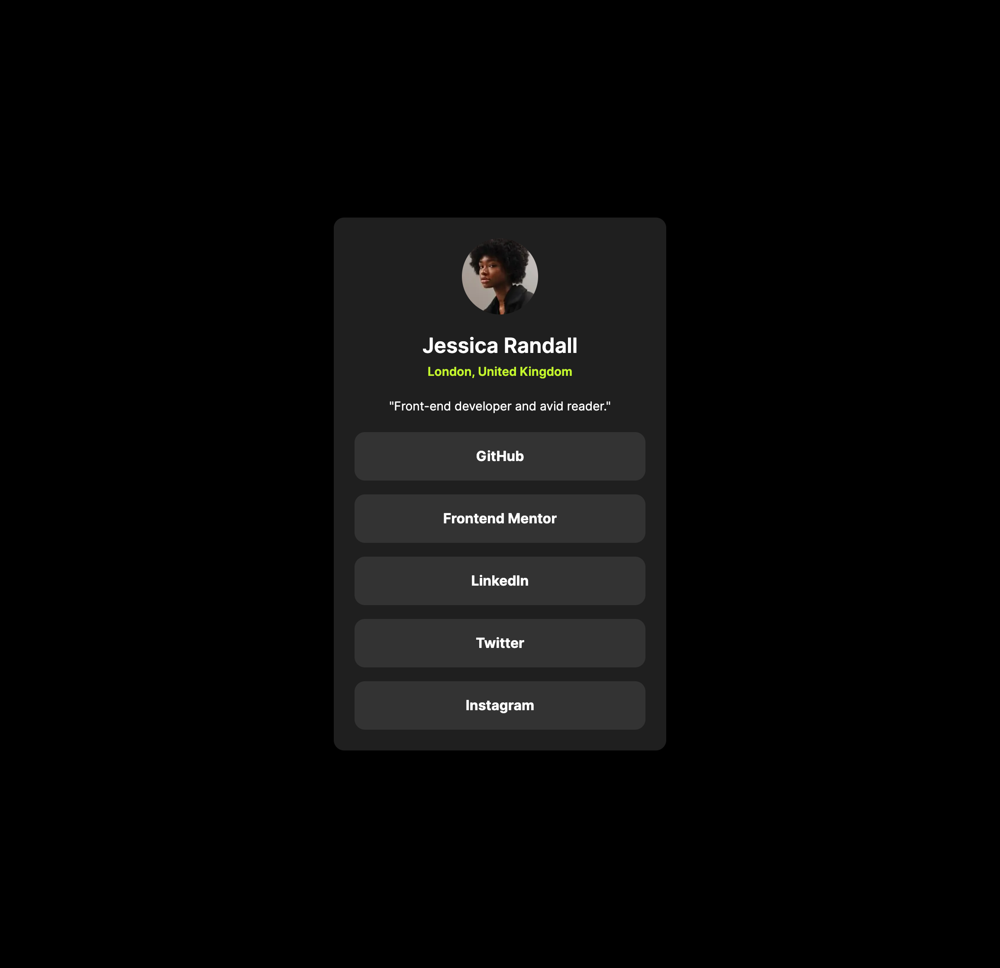

# Frontend Mentor - Social links profile solution

This is a solution to the [Social links profile challenge on Frontend Mentor](https://www.frontendmentor.io/challenges/social-links-profile-UG32l9m6dQ). Frontend Mentor challenges help you improve your coding skills by building realistic projects.

## Table of contents

- [Overview](#overview)
  - [The challenge](#the-challenge)
  - [Screenshot](#screenshot)
  - [Links](#links)
- [My process](#my-process)
  - [Built with](#built-with)
  - [What I learned](#what-i-learned)
  - [Continued development](#continued-development)
- [Author](#author)

## Overview

The challenge was to build out a social links page and get it looking as close to the design as possible. The design used was a JPEG file so i had to eye-ball the margins, text-size and padding.

### Screenshot

### Links

To be added

## My process

With this project I decided to really focus on using the correct semantic markup and take into consideration writing accessible code. I built it with mobile-first in mind.

### Built with

- Semantic HTML5 markup
- Tailwind CSS
- Mobile-first workflow
- [Next.js](https://nextjs.org/)

### What I learned

From the previous challenge, I carried over my knowledge of semantic markup. This time with focusing on writing accessible code, I did some research into screenreaders. As the design does not have any notable headings, anyone using a screenreader might struggle to understand the flow of the site. To solve this, I added headers at the top of each section : `<h2 className='sr-only'> Social Links </h2> `. The `sr-only` class from tailwind hides the element to the user, but allows for it to still be part of the document flow.

### Continued development

Moving forwards to the next challange, I plan on using what I have learned about semantic markup and accessible code with screenreaders, and implementing it to the best of my ability.

## Author

- Website - [Josh Gretton](https://www.joshgretton.co.uk)
