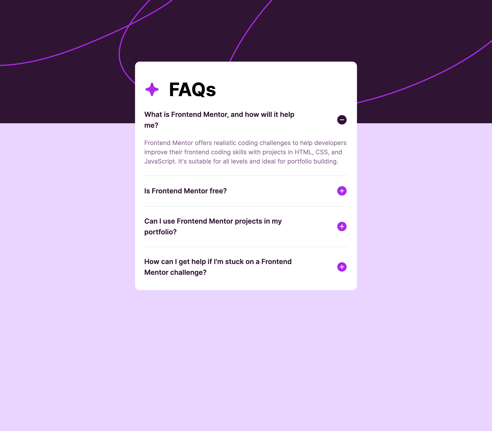

# Frontend Mentor - Social links profile solution

This is a solution to the [Social links profile challenge on Frontend Mentor](https://www.frontendmentor.io/challenges/social-links-profile-UG32l9m6dQ). Frontend Mentor challenges help you improve your coding skills by building realistic projects.

## Table of contents

- [Overview](#overview)
  - [The challenge](#the-challenge)
  - [Screenshot](#screenshot)
  - [Links](#links)
- [My process](#my-process)

  - [Built with](#built-with)
  - [What I learned](#what-i-learned)
  - [Continued development](#continued-development)
  - [Useful resources](#useful-resources)

- [Author](#author)

## Overview

The challenge was to build out a FAQ page with an accessible accordion and get it looking as close to the design as possible. The design used was a JPEG file so i had to eye-ball the margins, text-size and padding.
This is the challenge outline :

- Hide/Show the answer to a question when the question is clicked
- Navigate the questions and hide/show answers using keyboard navigation alone
- View the optimal layout for the interface depending on their device's screen size
- See hover and focus states for all interactive elements on the page

### Screenshot



### Links

To be added

## My process

To start with, I fleshed out the design with the correct HTML markup. I definitely needed to do some research into how to build an accordion accessibly. To make the code more maintainable and readable I decided to put all the FAQ questions and answers into a JSON file and map over them. My original approach was to use a `<ul>`, however, afted some research I found that it might be considered semantically less clear that each item is expandable / collapsable. After reading the Accessible Accordian article (linked below), I structured the accordion as such:

```
   <section>
                  <h2>
                    <button
                      id={`accordion-header-${index + 1}`}
                      aria-controls={`accordion-panel-${index + 1}`}
                      aria-expanded={isOpen[index]}
                      role="button"
                      onClick={() =>
                        setIsOpen((prevState) => {
                          //This allows for the accodian items to be independent of each other by keeping the previous values of the state
                          return { ...prevState, [index]: !isOpen[index] };
                        })
                      }
                    >
                      {faq.question}
                      {!isOpen[index] ? (
                        <svg></svg>
                      ) : (
                        <svg></svg>
                      )}
                    </button>
                  </h2>
                  <div
                    hidden={!isOpen[index]}
                    id={`accordion-panel-${index + 1}`}
                    aria-labelledby={`accordion-header-${index + 1}`}
                  >
                    <p>{faq.answer}</p>
                  </div>
                </section>
```

This seemed to be the approach that most people took. It provided a good document structure, but also allowed for the screenreader to keep context of the document (the full working version is in the codebase, just commented out). After digging a bit deeper into the HTML semantics, I found the `<details>` and `<summary>` elements. Not only did this provide the expansion and collapse features right out of the box, it also only allowed the summary to be focusable when the element is expanded. The `<details>` and `<summary>` elements have only been fully supported by browsers since January 2020. The added benefit was that I could remove all of the aria tags from the button and div elements as it was already provided on details and summary. The only problem I encountered was styling the SVGs to signify open and closed on the `<details>`. In the previous example it was simple, I could add local state and initialise it with an array of 'false' for the lengrh of the FAQs JSON array.

```
const [isOpen, setIsOpen] = useState(Array(FAQS.length).fill(false));
```

From this I could conditionally render the correct SVG. Now, I could continue with this with `<details>` but I wondered if there was a more efficient way using the built in features of the element. I was right! `<details>` has a boolean attribute `open`. It is automatically added and removed as the user interacts with the control and can be used in CSS to style the element based on its state. As the SVGs are within the `<summary>` and the `open`` attribute is present only within `<details>`, the css class needs to be placed on the parent.
`[&>summary>svg#minus-svg]:open:block [&>summary>svg#plus-svg]:open:hidden`
When using tailwind the square bracket [] allow you to put custom CSS arbitrary values in.

### Built with

- Semantic HTML5 markup
- Tailwind CSS
- Mobile-first workflow
- [Next.js](https://nextjs.org/)

### What I learned

- New HTML semantic elements `<dialog>` and `<summary>`

### Continued development

Moving forwards to the next challange, I plan on using what I have learned about semantic markup and accessible code with screenreaders, and implementing it to the best of my ability.

### Useful resources

- [Accessible Accordion](https://www.aditus.io/patterns/accordion/) - This article went into detail about different methods of implementation.
- [<details>: The Details disclosure element](https://developer.mozilla.org/en-US/docs/Web/HTML/Element/details#attributes) - MDNs web docs for the details html element
- [Tailwind discussions on data attributes](https://github.com/tailwindlabs/tailwindcss/discussions/10301) - This discussion and answer is what helped when figuring out how to show and hide the SVGs in side the summary element.

## Author

- Website - [Josh Gretton](https://www.joshgretton.co.uk)

```

```
