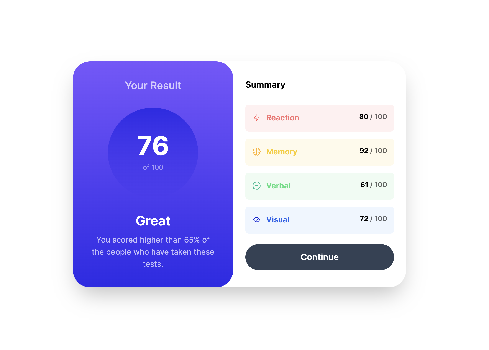

# Frontend Mentor - Social links profile solution

This is a solution to the [Social links profile challenge on Frontend Mentor](https://www.frontendmentor.io/challenges/social-links-profile-UG32l9m6dQ). Frontend Mentor challenges help you improve your coding skills by building realistic projects.

## Table of contents

- [Frontend Mentor - Social links profile solution](#frontend-mentor---social-links-profile-solution)
  - [Table of contents](#table-of-contents)
  - [Overview](#overview)
    - [Screenshot](#screenshot)
    - [Links](#links)
    - [Built with](#built-with)
    - [Continued development](#continued-development)
    - [Useful resources](#useful-resources)
  - [Author](#author)

## Overview

Your challenge is to build out this results summary component and get it looking as close to the design as possible. The design used was a JPEG file so i had to eye-ball the margins, text-size and padding.
This is the challenge outline :

- View the optimal layout for the interface depending on their device's screen size
- See hover and focus states for all interactive elements on the page
- **Bonus**: Use the local JSON data to dynamically populate the content

### Screenshot



### Links

To be added

### Built with

- Semantic HTML5 markup
- Tailwind CSS
- Mobile-first workflow
- [Next.js](https://nextjs.org/)

### Continued development

Moving forwards to the next challange, I plan on using what I have learned about semantic markup and accessible code with screenreaders, and implementing it to the best of my ability.

### Useful resources

## Author

- Website - [Josh Gretton](https://www.joshgretton.co.uk)

```

```
